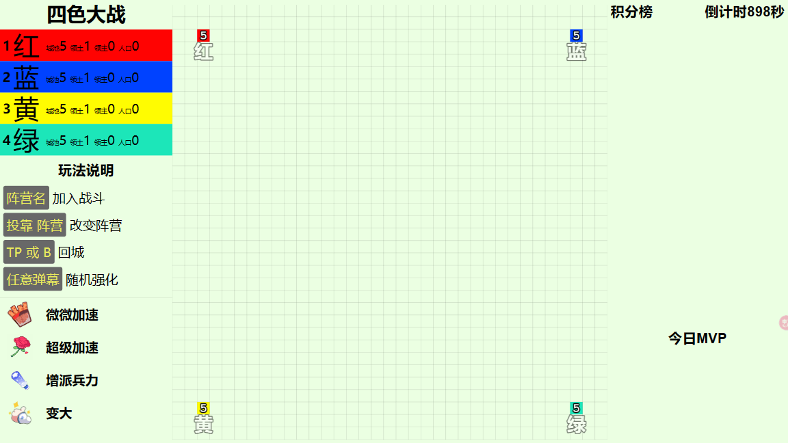
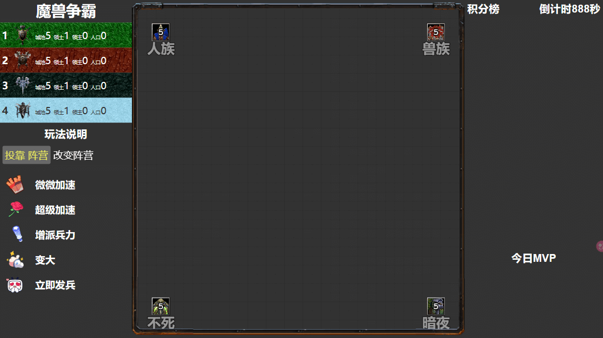
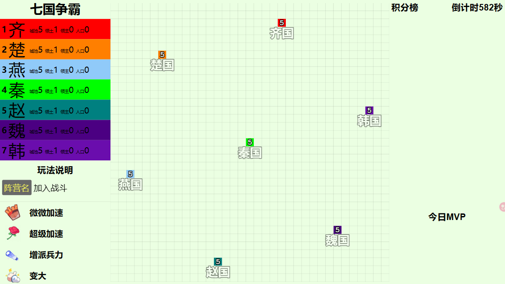

# 弹弹乐

曾风靡一时的弹幕互动游戏，支持多直播间、支持 B 站官方、野生 API、斗鱼野生 API

内置多款皮肤，且支持自定义贴图、颜色、名称：

- "default" 四色大战
  
- "fiveColor", 五色大战
- "threeKingDom", 三国大战
- "war3", 魔兽争霸 带贴图、兵种
  
- "jiangHu", 江湖传说
- "redAlert", 红色警戒
- "minecraft", 我的世界 带贴图
- "sevenKingDom7", 七国争霸
  
- "warOfFiveDynasties", 五朝之争

以上都可以在运行时临时自定义颜色、名称等（刷新生效）

## 快速开始

请先安装 node18+

```bash
# 没有 pnpm 的话可以 npm install -g pnpm
pnpm install
pnpm dev
```

浏览器打开 http://localhost:5173/

推荐开启开发者控制台，然后修改尺寸响应为 **1920x1080**

## 新增直播间

无数据库设计，编辑 `src\paid\index.ts` 新增直播间授权

```ts
// 直播间 ID
[key: number]: {
  name: string; // 随便编个名字
  id: number; // 直播间 ID
  defaultTheme: string; // 默认皮肤
  themes: string[]; // 允许使用的皮肤列表
  liveType?: "bilibili" | "douyu"; // 直播类型，斗鱼还是 b 站
};
```

配置后使用浏览器访问：`http://localhost:5173/{liveID}` 即可，要指定主题可以使用参数 `?theme={themeName}`

例如，访问我的直播间的魔兽争霸主题: `http://localhost:5173/1439885?theme=war3`

## 礼物配置

具体可查看 [src/Live/Gift.ts](./src/Live/Gift.ts)

## OBS 配置

不要使用直播姬，很卡，推荐使用 OBS ，新增一个浏览器，把权限都给了，大小配置 1920x1080，交互时按空格可自定义

## 部署

本质就是 node 应用

### 直接部署

```bash
pnpm build # 打包静态网页和 B 站头像、官方 API
# ./build 为后端接口
# ./dist 为游戏本体
pnpm start # 启动
```

浏览器打开 http://localhost:3000/

### 使用 Docker

```bash
pnpm docker:build # 构建镜像
docker run -P open-block-war # 创建容器
```
浏览器打开 http://localhost:3000/

## 注意事项

这个项目不再积极维护，已有 bug 也不会修复。

### 直播接口

新增 `?Code=` 参数即可开启 B 站官方接口

提供了斗鱼和 B 站的两套接口，具体实现可查看 [src/Live](./src/Live)

### 代理

如果使用的野生 ws 接口的话，修改 [api/proxy/ajax.ts](api/proxy/ajax.ts) 的相关配置即可设置获取头像的代理，不然如果人太多就会被 啊 B 暂时 ban 掉

### 金手指

便于开发和调试，具体可查看 [src/Game/GoldKey.ts](src/Game/GoldKey.ts)
